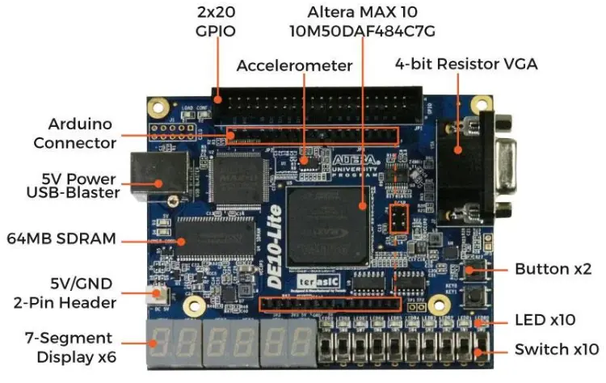

# Sign-Magnitude Adder on FPGA Board

## 👥​ Team:
* Lucas Gois Carneiro Batista

## 🌐​ Overview:
This project is based on coding an Intel FPGA board with the aim of correctly and safely implementing a simplified **sign-magnitude adder**, following the example presented in section 3.7.2 of *FPGA Prototyping by VHDL Examples* (Pong P. Chu, 2008). The circuit adds two numbers represented in sign-magnitude notation, deciding — from the signs of the operands — whether it must add or subtract the magnitudes, and it is adapted to run on the Intel/Altera/TerAsic DE10-Lite board using the switches as inputs and the LEDs and seven-segment displays as outputs.

## 🤔​ What Is An FPGA Board:
An FPGA (Field-Programmable Gate Array) is essentially a "blank" integrated circuit that can be completely reconfigured by the developer after it has been manufactured.

Unlike a common processor in your computer or cell phone, which comes with pre-defined and immutable circuit factories, an FPGA allows you to create your own digital hardware from scratch.



## 🔥​ Motivation:
The presented project is based on the development of VHDL code that implements a sign-magnitude adder on the Intel/Altera/TerAsic DE10-Lite board, using the board's switches (SW) as inputs and the LEDs (LEDR) and six seven-segment displays (HEX) as outputs. Regarding the importance of this project, it's worth noting that sign-magnitude is one of the classic ways of representing signed numbers in digital systems, and the adder that operates on it is a compact yet complete example of RT-level combinational design: it involves comparison, conditional addition/subtraction, sign selection and result normalization. Understanding how these blocks cooperate is a solid foundation for the more complex arithmetic units (such as two's-complement and floating-point adders) found in modern CPUs and GPUs.

## 🔢​ Number Structure:
Each operand is represented in **sign-magnitude** notation with the following elements (same width as Listing 3.14 / 3.15 of the book):

* Sign (1 bit): `0` = positive (`+`), `1` = negative (`-`)
* Magnitude (3 bits): an unsigned value in the range `0`–`7`

So a full operand is **4 bits** wide (`sign & magnitude`). Both operands are entered **simultaneously** through the switches:

* `SW3..SW0` — operand **A** (`SW3` = sign, `SW2..SW0` = magnitude)
* `SW7..SW4` — operand **B** (`SW7` = sign, `SW6..SW4` = magnitude)
* `SW9..SW8` — unused
* `KEY1..KEY0` — unused (ports kept for pin compatibility)

Example: the number **−5** is entered on A with `SW3 = 1` and `SW2..SW0 = 101`.

Valid results lie in the range **−7 … +7**. If the magnitude addition overflows that range, the rightmost displays show **`Er`** and `LEDR9` turns on.

## 🔨​ How It Works:
The implementation is divided into three distinct stages: data reception, data processing, and data output on the seven-segment displays and LEDs.

* **Input / display — `sign_mag_add_top.vhd`**: wires `SW3..0` and `SW7..4` directly into the adder (combinational, no load button). It drives six HEX digits — three for magnitudes and three for minus signs — with the **result on the right**, and shows `Er` on overflow. The decimal point is kept off on every digit.
* **Processing — `sign_mag_add.vhd`**: the core sign-magnitude adder (generic `N`; the top-level instantiates it with `N => 4`). It compares the signs of the two operands and, based on that, either adds the magnitudes (same sign) or subtracts the smaller magnitude from the larger one (different signs), choosing the correct output sign and flagging overflow.
* **Output — `hex_to_sseg.vhd`**: a hexadecimal-to-seven-segment decoder that converts each 4-bit nibble into the pattern that lights up the corresponding LEDs of a display.

Therefore:

* Input / display: `sign_mag_add_top.vhd`
* Processing: `sign_mag_add.vhd`
* Output: `hex_to_sseg.vhd` (instantiated inside the top-level)

On the DE10-Lite, `HEX5` is the **leftmost** digit and `HEX0` is the **rightmost**:

```
HEX5   HEX4    HEX3   HEX2    HEX1   HEX0
 ±      A       ±      B       ±     sum     (or Er on overflow)
```

| Display / LED | Meaning |
|---------------|---------|
| `HEX5` | sign of A (middle bar `−` if negative, blank if positive) |
| `HEX4` | magnitude of A (`0`–`7`) |
| `HEX3` | sign of B |
| `HEX2` | magnitude of B (`0`–`7`) |
| `HEX1` | sign of the result, or **`E`** when overflow |
| `HEX0` | magnitude of the result, or **`r`** when overflow (`Er`) |
| `LEDR0` | sign of A (on = negative) |
| `LEDR1` | sign of B (on = negative) |
| `LEDR2` | sign of the result (on = negative; off when showing `Er`) |
| `LEDR9` | overflow (`\|A + B\| > 7`) |

## 🔧​ Tools Used:
The development of this project focused on two tools: GHDL (with GTKWave) and Quartus Prime. Both are geared towards the analysis, compilation, and simulation of digital circuit designs. GHDL offers a very simple way to simulate testbenches and, being free software, allows its use by a larger number of people; the resulting waveforms are inspected in GTKWave. Quartus Prime is Intel's software (with a free *Lite* edition) and is a more complete tool, used here for the **logic synthesis** of the circuit and for programming the DE10-Lite board. In this project, GHDL + GTKWave was used to functionally validate the arithmetic behavior of the adder, and Quartus Prime Lite was used for logic synthesis and to run the design on real hardware.

## ​🎯​ Fundamental Operations:
1. **Split**: each operand is split into its sign bit and its magnitude field.
2. **Compare signs**: the signs of the two operands are compared to decide the operation.
3. **Add / Subtract**:
   * If the signs are **equal**, the magnitudes are added and the common sign is kept.
   * If the signs are **different**, the smaller magnitude is subtracted from the larger one, and the sign of the larger magnitude is kept.
4. **Normalization**: a zero result always receives the `+` sign (there is no "−0"). When the magnitudes are added and the sum does not fit in 3 bits (`|sum| > 7`), an **overflow** flag is raised (`LEDR9`) and the rightmost displays show **`Er`**.

## ​🧩​ Example:
* A: Sign = `0` (+), Magnitude = `5` → **+5** (`SW3..0 = 0101`)
* B: Sign = `1` (−), Magnitude = `3` → **−3** (`SW7..4 = 1011`)

Since the signs are different, the adder subtracts the magnitudes (`5 − 3 = 2`) and keeps the sign of the larger magnitude (A, positive):

`(+5) + (−3) = +2` → `HEX4=5`, `HEX2=3`, `HEX0=2`, with `HEX5`/`HEX3`/`HEX1` blank (no minus) and `LEDR2` off.

A second example showing overflow:

* A: Sign = `0` (+), Magnitude = `7` → **+7**
* B: Sign = `0` (+), Magnitude = `1` → **+1**

Same sign, so the magnitudes are added: `7 + 1 = 8`, which does not fit in 3 bits. `HEX1 HEX0` show **`Er`**, and `LEDR9` turns on. The same happens for sums below −7 (e.g. `(−7) + (−1)`).

## ​🧪​ Simulation Micro-Tutorial (GHDL + GTKWave):

The whole simulation suite runs with a single command from the project root:

```bash
./sim/run_sim.sh            # add --wave to open the waveforms in GTKWave
```

It runs four testbenches and a synthesis check, writing the waveforms to `build/`:

| Testbench | What it verifies | Result |
|---|---|---|
| `sign_mag_add_orig_tb` | The **original book adder** (Listing 3.14, N=4), unmodified | 6/6 ✅ |
| `sign_mag_add_tb` | The **adapted core** (N=9, overflow + zero normalization) | 7/7 ✅ |
| `hex_to_sseg_tb` | The 7-seg decoder against the DE10-Lite pin mapping | 16/16 ✅ |
| `sign_mag_add_top_tb` | The **complete top-level**: simultaneous SW inputs (N=4), sign/magnitude HEX pairs, `Er` on overflow, DP off | ✅ |

All testbenches self-check with `assert`, so **any line containing `(assertion error)` means a failure**; a clean run prints only `report note` lines. The `metavalue detected` warnings at time 0 are expected (they occur before the stimuli reach the inputs) and are filtered by the script.

To run a single simulation manually — for example the original book code:

```bash
ghdl -a --std=08 --workdir=build/orig Projeto-VHDL/sign_mag_add.vhd sim/sign_mag_add_orig_tb.vhd
ghdl -e --std=08 --workdir=build/orig sign_mag_add_orig_tb
ghdl -r --std=08 --workdir=build/orig sign_mag_add_orig_tb --vcd=orig.vcd --stop-time=200ns
gtkwave orig.vcd
```

> **Note on work libraries:** the original adder and the adapted one declare the *same* entity name (`sign_mag_add`), so each simulation must use its own `--workdir`, otherwise one overwrites the other.

In GTKWave, add `a`, `b`, `sum` (and `ovf`, in the adapted version) to observe each test case.

## ​🔬​ Comparative Analysis (original × adapted):

Both versions implement the same algorithm from Chu, and the four sign combinations produce identical results. Simulation revealed **two limitations of the original code**, both reproduced in `sign_mag_add_orig_tb`:

| Case | Original (Listing 3.14) | Adapted (`src/`) |
|---|---|---|
| `(+5) + (−5)` | `1000` = **−0**: the sort takes the `else` branch when the magnitudes are equal, so it keeps `sign_b` | `+0`: a zero result is normalized to `+` |
| `(+7) + (+7)` | `0110` = **+6**: 14 does not fit in 3 bits and is truncated **silently** | magnitude wraps *and* raises `ovf` → `LEDR9` (+ top-level shows `Er`) |

A third difference is in the **7-segment decoder**. The book's `hex_to_sseg` (Listing 3.12) puts segment `a` in the *most* significant bit (`sseg(6)=a … sseg(0)=g`), but on the DE10-Lite the pin order is the opposite (`HEX0[0]=a … HEX0[6]=g`, see `de10_lite.qsf`). The decoder in `src/` is therefore **bit-reversed** relative to the book's. `hex_to_sseg_tb` proves this is required: the adapted decoder passes 16/16 digits, while the book's original fails 14/16 on this board (only `8` and `A` pass, since their patterns happen to be palindromes).

Finally, the book's testing circuit (`sm_add_test.vhd` + `disp_mux.vhd`) time-multiplexes four displays and uses the pushbuttons to select which value to show, because the target DE1 board shares the segment pins between displays. The DE10-Lite has **six independent, non-multiplexed HEX displays**, so `disp_mux` is unnecessary: the top-level drives A, B and the result at once — each with its own sign digit — matching the lab requirement of three magnitude digits and three minus-sign digits, with the sum on the rightmost pair.

## ​🧠​ Usage Tutorial: DE10-Lite + Quartus Prime Board:
1. Open Quartus Prime (Lite) version 20.1 or newer.
2. In the upper left corner, click "File" and then "New Project Wizard".
3. Click "Next". In the next tab, choose a folder and name the project **`sign_mag_add`**. Click "Next".
4. Choose "Empty project" and click "Next".
5. In the "Add Files" tab, add `sign_mag_add.vhd`, `hex_to_sseg.vhd` and `sign_mag_add_top.vhd` (from the `src` folder). Click "Next".
6. In the "Family, Device & Board Settings" tab:
   * In the "Family" field, select "MAX 10 (DA/DF/DC/SA/SC)".
   * In the "Name filter" field, type **`10M50DAF484C7G`**.
   * Select the device that appears and click "Next".
7. In the "EDA Tool Settings" tab you may leave the defaults (or select "ModelSim-Altera" / "VHDL" for simulation). Click "Next".
8. Review the summary and click "Finish".
9. Set the top-level entity to **`sign_mag_add_top`** (right-click the entity in the Project Navigator → "Set as Top-Level Entity").
10. Import the pin assignments: click "Assignments" → "Import Assignments...", select `src/de10_lite.qsf` and click "OK". This maps the switches, pushbuttons, LEDs and displays used by the design.
11. Connect the DE10-Lite board to the computer via USB cable.
12. Click "Processing" → "Start Compilation" and wait for it to finish with zero errors.
13. In the "Task" window, double-click "Program Device (Open Programmer)".
14. In the Programmer window, click "Hardware Setup", select the USB-Blaster in "Currently selected hardware" and close. Make sure "Mode" is set to "JTAG".
15. Click "Start" to program the board.

After these steps the board is running and ready to perform sign-magnitude additions.

## ​🧠​ User Tutorial: Arithmetic Tests on the DE10-Lite Board:
Both operands are set at the same time on the switches; the result updates continuously (no load button).

1. Set operand **A** on `SW3..SW0` (`SW3` = sign, `SW2..0` = magnitude 0–7). Its sign appears on `HEX5` and its magnitude on `HEX4`.
2. Set operand **B** on `SW7..SW4` (`SW7` = sign, `SW6..4` = magnitude 0–7). Its sign appears on `HEX3` and its magnitude on `HEX2`.
3. Read the result on the right: sign on `HEX1`, magnitude on `HEX0`. `LEDR0`/`LEDR1`/`LEDR2` mirror the signs; `LEDR9` lights up on overflow.
4. Try an overflowing case, e.g. A = `+7` (`SW3..0 = 0111`) and B = `+1` (`SW7..4 = 0001`): `HEX1 HEX0` show **`Er`** and `LEDR9` turns on.
5. To try another operation, just move the switches — A, B and the sum follow them immediately.
